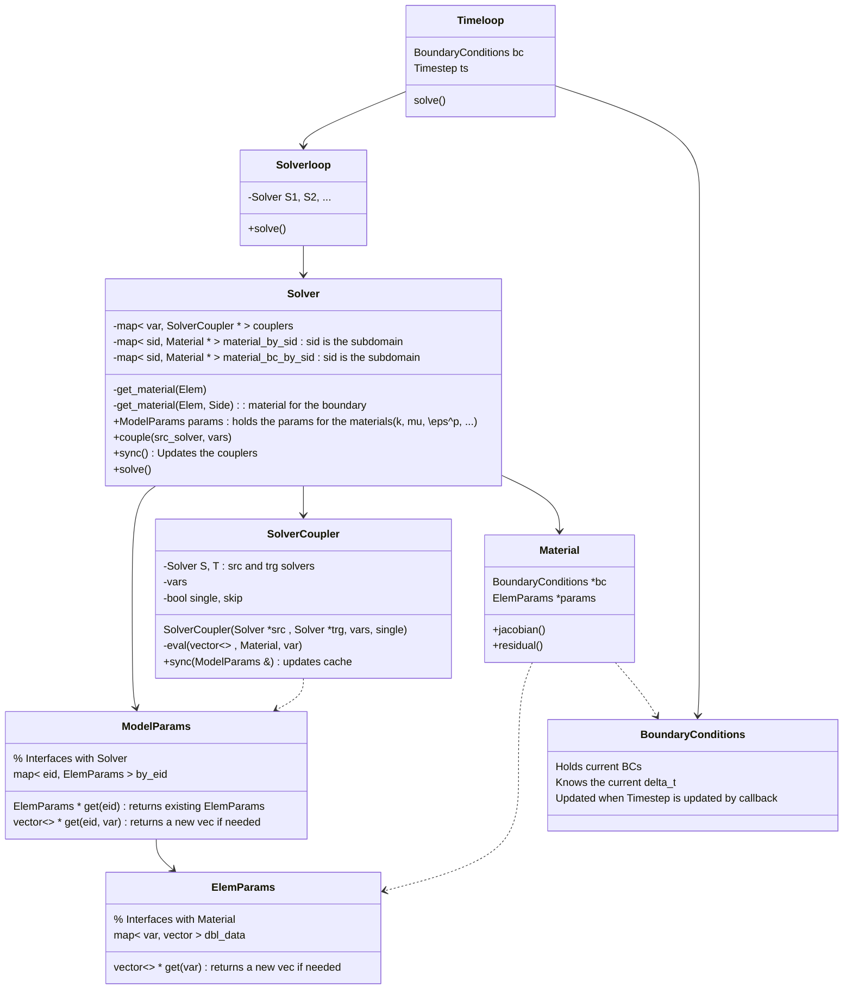
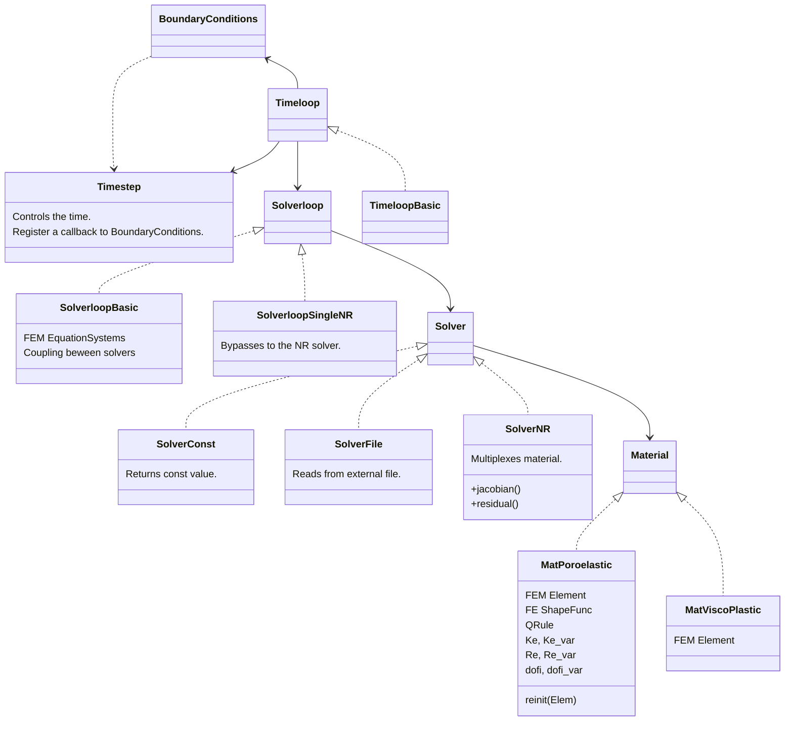

## Organization of source files - include/ and src/

| Directory  | Content                                                                                                                                |
|------------|----------------------------------------------------------------------------------------------------------------------------------------|
| base       | Logger and global utilities. Most source files will use these components.                                                               |
| config     | Configuration files that read JSON and provide processed (validated with default values) getters.                                       |
| harpy      | The heart of Harpy: abstract interface definitions for multiple modules.                                                               |
| material   | Material definitions sharing the harpy/Material interface.                                                                             |
| solver     | Solver implementations sharing the harpy/Solver interface.                                                                             |
| solverloop | SolverLoop implementations sharing the harpy/SolverLoop interface (coupling between multiple solvers).                                 |
| timeloop   | Timeloop implementations sharing the harpy/Timeloop interface. Handles different methods of time advancement.                          |
| util       | Peripheral code for various purposes. Includes file handling, string handling, output operators, etc.                                   |

## Class diagram

#### Interfaces

#### Implementation

##  Algorithms

#### Timeloop::Timeloop()

<pre>
    Create Timestep structure
    Add TS callback to BoundaryConditions (created during config)
</pre>

#### Timeloop::Timeloop()
<pre>
    while ( true ) 
        Solverloop.solve()
        Solverloop.export()
        Timestep.next()
        if ( Timestep > max ) : break
</pre>

#### SolverCoupler::eval( vector<> out, Material TM, var )
Evaluates the values at the quadrature points of the target materials.
Register in the entries_by_eid. Only in the processor that owns the element.
Can save some time if the meshes are the same.
<pre>
    qpxyz = TM.get_qpxyz()                 // The points of each quadrature point in the target
    foreach (Point pt) in (qpxyz)
        Elem SE = S.find_elem( pt )        // Colective task! All processors in sync
        Mat SM = S.get_material( SE )      // Source material (shape funcs)
        if ( curr_proc )
            val = SM.calc()                // Now only the right processor does the calc
            out.push( ce )
</pre>
        
#### Solver::sync()
Creates a fully calculated structure in each integration point of the target based on the
registered couplers.
<pre>
    foreach coupler : coupler.sync( params )
</pre>

#### SolverCoupler::sync( ModelParams & params)
Updates the model parameters of this solver.
This can be a single-time or a recurrent runner.
Example: single-time 
<pre>
    if ( skip ) return

    foreach (Elem E) in (T)
        foreach (v) in (vars)
            ret = & params.get(e,v)                   // Gets the reference
            ret.clear()
            eval( ret, T.get_material(E), var )  

    if ( single ) skip = true
</pre>

#### Solverloop::Solverloop()
Constructor - in the child classes

<pre>
    Solver S1, S2                   // Instantiate the desired types
    S2.couple( S1, var )            // Sets the coupling - e.g., S1 => S2
</pre>

#### Solverloop::solve()
Integrates many solvers.
This workflow should be implemented in the child classes.
<pre>
    while ( true )
        S1.sync()
        S1.solve()

        S2.sync()
        S2.solve()

        if (converged) : break
        if (maxit) : break

        // export intermediate results for debugging
</pre>

#### Solver::get_material( Elem E )   && get_material( Elem E, Side S )
Retrieves the material for the element.
Creates a new one if does not exist (lazy worker).
The material holds the FE shape functions and quadrature points for integration.
It is responsible for building the element matrix and RHS.

Two versions: one for the element, another for a side of the element.
The FE structures are the same, but the dimensions are different.

<pre>
    sid = E.subdomain()
    if not material_by_sid[sid] :
        material_by_sid[sid] = Material::Factory(sid)

    material_by_sid[sid].reinit(E, )
</pre>

And for the boundary constrain
<pre>
    sid = E.subdomain()
    if not material_bc_by_sid[sid] :
        material_bc_by_sid[sid] = Material::Factory(sid, 1)

    material_bc_by_sid[sid].reinit(E, S)
</pre>
#### Solver::Solver
Creates all materials of the local processor upfront.

<pre>
    for (Elem E) in (this.local) : get_material(E)   // Create all materials.  
</pre>
    
#### **static** Material::Factory( sid, BC )
Multiplexes the material from the configuration.
Instantiates the right material for the element.
Should only be called if it hasnt been created before (see Solver::get_material)

If BC=True, the material refers to a boundary constraint (reduced dimension).
<pre>
    matid = get_material_id(sid) 
    if matid == VISCOPLASTIC :
        return new MatViscoPlastic( E, BC ) 
    if matid == POROELASTIC :
        return new MatViscoPlastic( E, BC )
</pre>

#### Material::Material( EquationSystem, System )
The constructor should be able to query the configuration structure, build the 
FE structures for the material, the element matrix and RHS structure etc.

This constructor fetches all the information needed from EquationSystems,
like the volume of parameters (permeability, porosity etc). Thhe best is to
map these parameters into an input_system to be queried in the jaobian and
residual functions. 

Positions the submatrices and subvectors into the element Ke and Re.
Example:
<pre>
Ke = [ [ K00 K01 K02 ]
       [ K10 K11 K12 ]
       [ K20 K21 K22 ] ]
</pre>
where 0, 1 and 2 are the variables we are interested.
They must match dofi so that add_matrix and add_vector work seemlessly.

#### Material::reinit( Elem E )
Reinitializes the FE shape function and quadrature for the element.

#### Material::jacobian( solution, K )  &&  jacobian_bc( solution, K )
Fills the global matrix K with the contributions of the current element.
**jacobian_bc** adds the boundary conditions equations to the matrix if the 
material is a boundary constrain material.

#### Solver::jacobian( solution, K )
Multiplexes the material and calls the jacobian in the material.

<pre>
    // Continua
    for (Elem E) in (local.this)
        M = get_material(E)
        M.jacobian( solution, K )

    // Boundary conditions
    for (Elem E) in (local.this)
    for (Side S) in (E)
        if ( not has_bc ) continue
        M = get_material( E, S )
        M.jacobian_bc( solution, K )      // Tells the material to build the BC jacobian
</pre>
