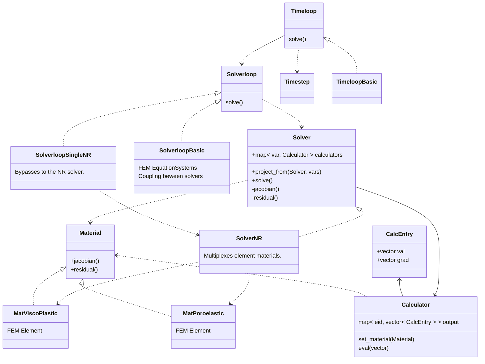

## Organization of soiurce files

| Directory  | Content                                                                                                                                |
|------------|----------------------------------------------------------------------------------------------------------------------------------------|
| base       | Logger and global utilities. Most source files will use these components.                                                               |
| config     | Configuration files that read JSON and provide processed (validated with default values) getters.                                       |
| harpy      | The heart of Harpy: abstract interface definitions for multiple modules.                                                               |
| material   | Material definitions sharing the harpy/Material interface.                                                                             |
| solver     | Solver implementations sharing the harpy/Solver interface.                                                                             |
| solverloop | SolverLoop implementations sharing the harpy/SolverLoop interface (coupling between multiple solvers).                                 |
| timeloop   | Timeloop implementations sharing the harpy/Timeloop interface. Handles different methods of time advancement.                          |
| util       | Peripheral code for various purposes. Includes file handling, string handling, output operators, etc.                                   |

##  Algorithms

#### Material Solver::get_mat(Elem E):
Returns the material of a given element in the context of this solver.
The material holds the FE shape functions and quadrature points for integration.
It is responsible for building the element matrix and RHS.

#### Solver::project_from(Solver S, vars):
Creates a fully calculated structure in each integration point of the target.
Remember: if we need to find elements by point, this is a collective task (need to iterate in all
elements of the mesh in all processors, in sync).
<pre>
    foreach (Elem E) in (this)
        Mat SM = S.get_mat( E )         // Source material (shape funcs)
        Mat TM = get_mat( E )           // Target material (shape funcs)
        qpxyz = TM.get_qpxyz()          // The points of each quadrature point in the target
        foreach (var) in (vars)
            calc = calculators[var]
            calc.set_material( SM )
            calc.eval( qpxyz )              // CalcEntry holds the information at the list of points
</pre>
