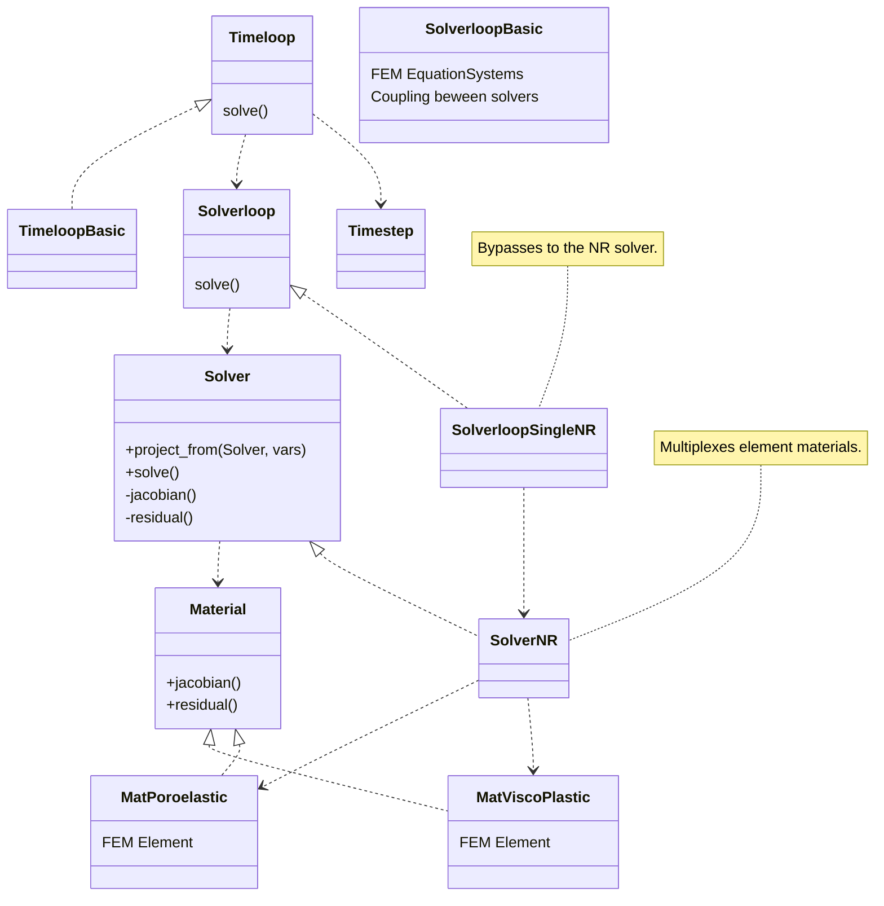

## Organization of soiurce files

| Directory  | Content                                                                                                                                |
|------------|----------------------------------------------------------------------------------------------------------------------------------------|
| base       | Logger and global utilities. Most source files will use these components.                                                               |
| config     | Configuration files that read JSON and provide processed (validated with default values) getters.                                       |
| harpy      | The heart of Harpy: abstract interface definitions for multiple modules.                                                               |
| material   | Material definitions sharing the harpy/Material interface.                                                                             |
| solver     | Solver implementations sharing the harpy/Solver interface.                                                                             |
| solverloop | SolverLoop implementations sharing the harpy/SolverLoop interface (coupling between multiple solvers).                                 |
| timeloop   | Timeloop implementations sharing the harpy/Timeloop interface. Handles different methods of time advancement.                          |
| util       | Peripheral code for various purposes. Includes file handling, string handling, output operators, etc.                                   |

2. **function** Merge(A, low, mid, high):
   1. Create temporary arrays L and R
   2. Copy A[low...mid] to L
   3. Copy A[mid+1...high] to R
   4. i = 0, j = 0, k = low
   5. **while** i < length(L) **and** j < length(R) **do**
      1. **if** L[i] ≤ R[j] **then**
         1. A[k] = L[i]
         2. i = i + 1
      2. **else**
         1. A[k] = R[j]
         2. j = j + 1
      3. k = k + 1
