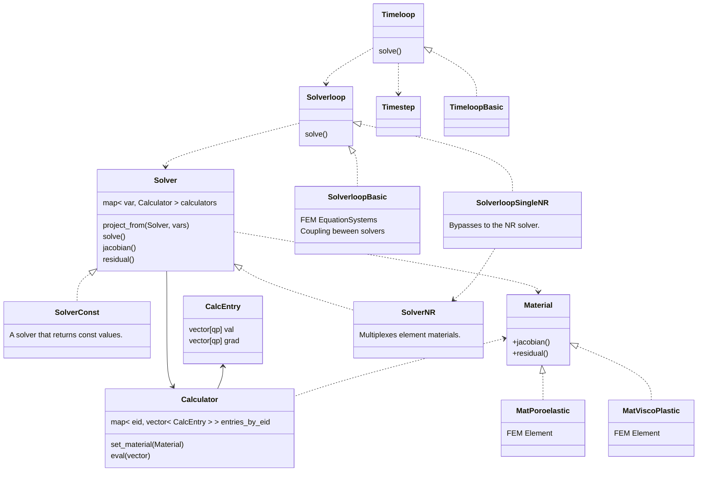

## Organization of soiurce files

| Directory  | Content                                                                                                                                |
|------------|----------------------------------------------------------------------------------------------------------------------------------------|
| base       | Logger and global utilities. Most source files will use these components.                                                               |
| config     | Configuration files that read JSON and provide processed (validated with default values) getters.                                       |
| harpy      | The heart of Harpy: abstract interface definitions for multiple modules.                                                               |
| material   | Material definitions sharing the harpy/Material interface.                                                                             |
| solver     | Solver implementations sharing the harpy/Solver interface.                                                                             |
| solverloop | SolverLoop implementations sharing the harpy/SolverLoop interface (coupling between multiple solvers).                                 |
| timeloop   | Timeloop implementations sharing the harpy/Timeloop interface. Handles different methods of time advancement.                          |
| util       | Peripheral code for various purposes. Includes file handling, string handling, output operators, etc.                                   |

##  Algorithms

#### Material Solver::get_mat(Elem E):
Returns the material of a given element in the context of this solver.
The material holds the FE shape functions and quadrature points for integration.
It is responsible for building the element matrix and RHS.

#### Calculator::eval( Solver S, Elem TE, var )
Evaluates the values at the quadrature points of the target materials.
Register in the entries_by_eid. Only in the processor that owns the element.
<pre>
    Mat TM = get_mat( TE )                 // Target material (shape funcs)
    qpxyz = TM.get_qpxyz()                 // The points of each quadrature point in the target
    foreach (Point pt) in (qpxyz)
        entries = entries_by_eid[TM.eid]
        Elem SE = S.find_elem( pt )        // Colective task! All processors in sync
        Mat SM = S.get_mat( SE )           // Source material (shape funcs)
        if ( curr_proc )
            CalcEntry ce = SM.calc()       // Now only the right processor does the calc
            entries.push( ce )
</pre>
        
#### Solver::project_from(Solver S, vars):
Creates a fully calculated structure in each integration point of the target.
Remember: if we need to find elements by point, this is a collective task (need to iterate in all
elements of the mesh in all processors, in sync).
<pre>
    foreach (Elem E) in (this)
        foreach (var) in (vars)
            calc = calculators[var]
            calc.eval( S, E, var )  // CalcEntry holds the information at the list of points
</pre>

#### Solverloop::solve():
Integrates many solvers.
This workflow should be implemented in the child classes.
<pre>
    Solver S1, S2                   // Instantiate the desired types
    while ( true )
        S1->project_from( S2, vars )
        S1->solve()

        S2->project_from( S1, vars )
        S2->solve()

        if (converged) : break
        if (maxit) : break

        // export intermediate results for debugging
</pre>
